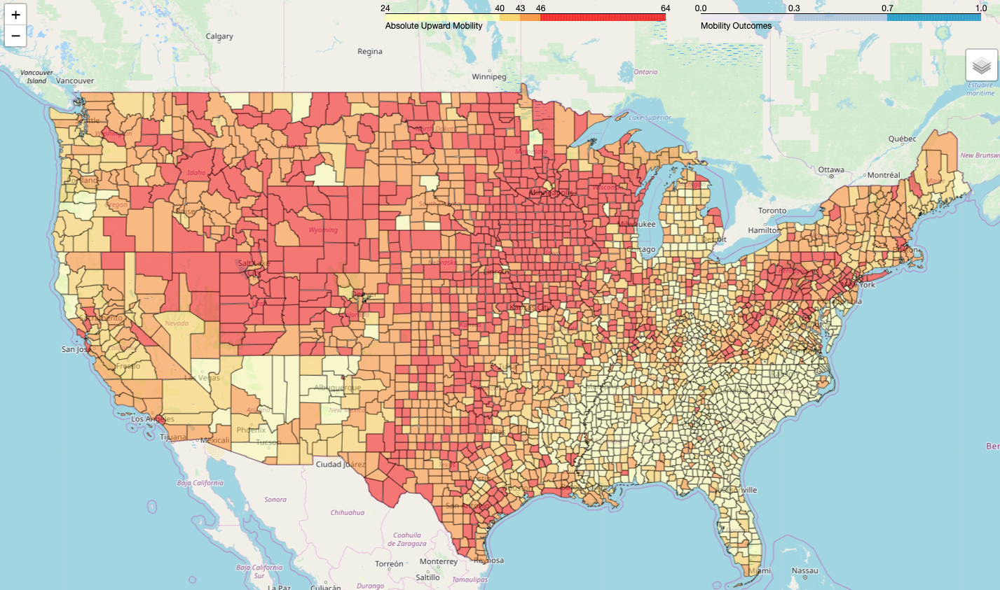

# Does the 'American Dream' exist in America? 

#### -- Project Status: [Active]

## Project Introduction & Objective

For children raised in lower- to middle- income families, where they grow-up impacts their long-term outcomes. Inspired by the extensive series of studies by the Opportunity Insights team housed at Harvard University, this project explores what aspects of an area account for the impact on economic outcomes. 

Additionally, this project is an exercise in visualizing geographic trends of Absolute Upward Mobility by US County. The static image (shown above) is a preview of the interactive map that displays mobility figures for children born into families at the 25th percentile of the national income distribution.
The visualization can be found [here](http://nateej1.github.io/AmericanDream_Geo) and project slides with further detail [here](https://drive.google.com/open?id=1kgFc8XZJ-JGDLEMXgHrtzB9Rw8NsO-NQ).

### Project Contact
|Name     |  Github Page   |  Personal Website  |
|---------|-----------------|--------------------|
|Nateé Johnnson | [nateej1](https://github.com/nateej1)| [nateej1.github.io](https://nateej1.github.io/)  |

### Methods Used
* Inferential Statistics
* Machine Learning
* Data Visualization
* Classification Modeling

### Technologies
* Python
* Pandas, jupyter
* Folium
* HTML

## Project Description

Previous studies have determined that where you grow up impacts your ability to move up in the national economic rankings. This project furthers that line of study by asking "what about where you're from matters?". Using income distribution data from [Opportunity Insights](https://opportunityinsights.org/neighborhoods/), county-level data was merged with county "features" collected/provided by [County Health Rankings](https://countyhealthrankings.org).
A Random Forest Classifier was employed to distinguish between counties labeled as "mobile" and "not mobile", "mobile" being defined as children raised in that county, on average, move at least 25 percentiles beyond their parents' economic ranking. The model was then queried for which features were most important in successfully distinguishing between these counties. Of the available features, share of income held by middle class, teen pregnancy rate, and unemployment rate were the most important distinguishing factors. 
The map visualization created provides two layers of exploration. When selected singularly, the layer titled "Can Child Move At Least 1 Quartile Up", shows how each county was defined for the purposes of this study. Markers indicate the highest and lowest mobility counties. When singularly selecting the "Absolute Upward Mobility" layer, users can hover over an area to learn the statistics specific to that county.

Future work includes: 
* Incorporating more county data (education, business ownership, transporation, etc.)
* Enhancing interactivity of map by including slider to change the "origin economic ranking"
* Further parameter tuning for the classifier
* More rigorous feature engineering analysis

## Featured Deliverables
* [National Intergenerational Economic Mobility - Slides](https://drive.google.com/open?id=1kgFc8XZJ-JGDLEMXgHrtzB9Rw8NsO-NQ)
* [Absolute Upward Mobility - Map](http://nateej1.github.io/AmericanDream_Geo)
* [Blog Post](#)

---

This file structure is based on the [DSSG machine learning pipeline](https://github.com/dssg/hitchhikers-guide/tree/master/sources/curriculum/0_before_you_start/pipelines-and-project-workflow).
